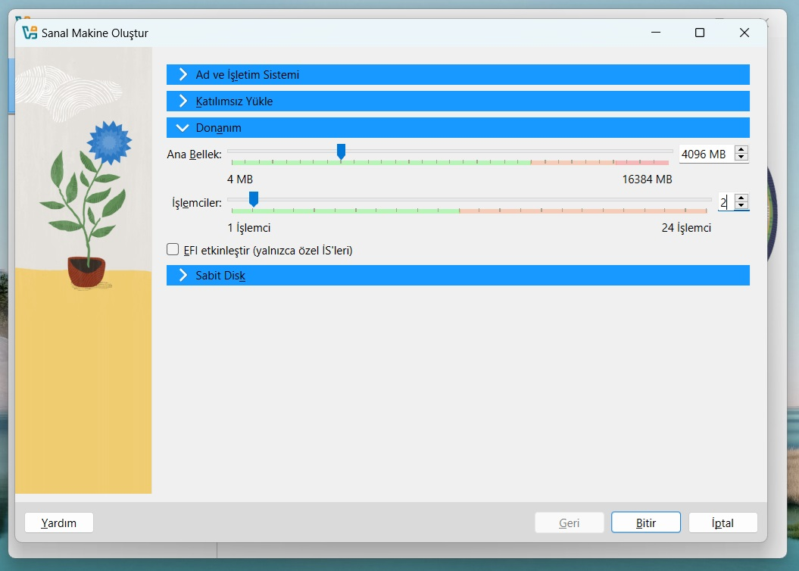

Bootcamp, sanal makine yapısından faydalanacaktır. Bu yapı, bilgisayarınızın içinde başka bir bilgisayar oluşturmayı sağlar. Bilgisayarınızda bir aksaklık çıkma riski oluşmadan rahatça çalışabileceksiniz. 
Kullanılan Linux dağıtımı Ubuntu, versiyonu ise 22.04 LTS (server) olacaktır.  
Sunucumuza `ssh` programı ile bağlanacağız. Windows 10 ve 11'de yüklü gelen komut istemi (cmd.exe) üzerinde SSH programını kullanabilirsiniz.   
Kısacası, **Bootcamp VirtualBox ve Ubuntu 22.04 LTS üzerinden işlenecektir.**


# İndirilmesi Gereken Dosyalar:
* [VirtualBox 7.1.4 (110~ MB)](https://download.virtualbox.org/virtualbox/7.1.4/VirtualBox-7.1.4-165100-Win.exe)
* [Ubuntu 22.04 LTS (2~ GB)](https://releases.ubuntu.com/jammy/ubuntu-22.04.5-live-server-amd64.iso)

# VirtualBox Rehberi
* İndirdiğimiz kurulum dosyasını yönetici olarak çalıştırın.
* Standart kurulumu uygulayın.
* Bilgisayarınızı yeniden başlatın.

# Ubuntu 22.04 LTS Kurulum Rehberi
* Yönetici olarak VirtualBox'ı açın.
* "Yeni" tuşuna basın, belirtilen şekilde yapılandırın.
  * Ad ve İşletim Sistemi:
    * Ad: `ubuntu`
    * ISO Kalıbı: İndirdiğimiz Ubuntu iso dosyası.
  * Katılımsız Yükle:
    * Kullanıcı adı: `ubuntu`
    * Parola: `ubuntu`
    * Parolayı tekrarla: `ubuntu`
  * Donanım:
    * Ana Bellek: 4096 MB
    * İşlemciler: 2
* Yapılandırma bu şekilde gözükmeli:



* Uyuşuyor ise Bitir tuşuna basın. Kurulum otomatik olarak başlayacaktır.
* Kurulumun tamamlanmasını bekleyin. Tamamlandığında "Ubuntu login" yazacaktır. Kurulum sırasında sanal makine birkaç defa yeniden başlayabilir. Bu durum normaldir.
* Kurulum tamamlandıktan sonra üst menüden **Makine** -> **ACPI Kapama** seçeneğine tıklayın.
* VirtualBox ana ekranında **Araçlar Kısmındaki Üç Çizgi** -> **Ağ** seçeneğine tıklayın.


* Ağ ekranında, **"Yalnızca-Anamakine Ağları"** seçeneğine ve **"Oluştur"** seçeneğine tıklayın.

* Alt kısımdaki **"DHCP Sunucusu"** seçeneğine tıklayın ve **"Sunucuyu Etkinleştir"** kutusunu tikleyin.

* Uygula tuşuna tıklayın.
* **"ubuntu"** yazan sanal makineyi seçin.
* Ayarlar tuşuna tıklayın.
* **"Uzman"** tuşuna tıklayın.
* **"Ağ"** -> **"Bağdaştırıcı 2"** yolunu izleyerek ayar menüsüne gelin. Şu şekilde yapılandırın:
  * Ağ Bağlantısını Etkinleştir: tikli
  * Şuna Takılı: "Yalnızca-Anamakine Bağdaştırıcısı"
  * Karma Kipi: "Tümüne İzin Ver"
  * Kablo Bağlandı: tikli


# Sanal Makinenize Erişim
* **Sanal makinenizi her kapattığınızda aşağıdaki adımları uygulamanız gerekmektedir.**
* VirtualBox üzerinden sanal makinenizi çalıştırın.
* `ubuntu` kullanıcı ismi ve `ubuntu` parolası ile giriş yapın
  * Not: Parolanız yazarken gözükmeyecektir
* Aşağıdaki komutları yazın. (İlk komut parolanızı soracaktır)
```bash
sudo loadkeys tr
sudo apt install openssh-server -y
sudo dhclient -v enp0s8
```
* Ekranınızda "bound to: x.x.x.x" kısmında yazan sayı sunucunuzun IP adresidir.
* Komut istemini açın. (kısayol: Win+R, cmd, enter)
* `ssh ubuntu@x.x.x.x` kısmını sunucuzun IP adresi olacak şekilde yazın


